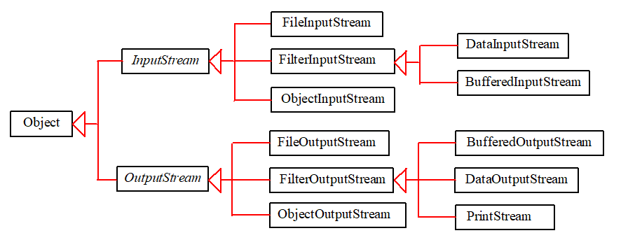
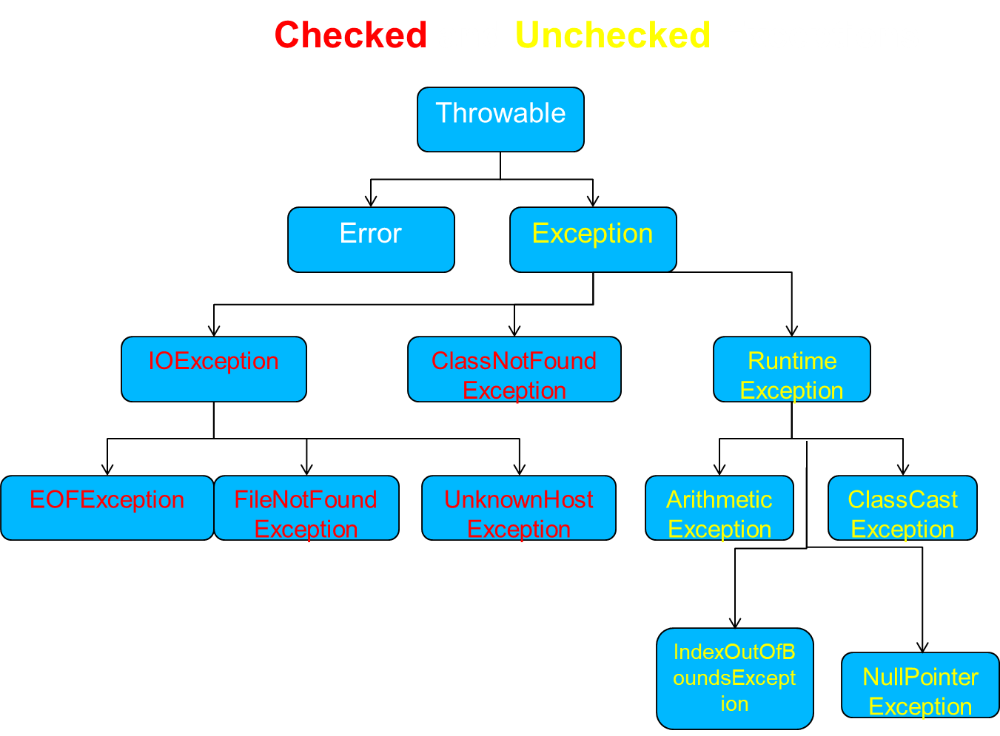

# 📘 Tài liệu Java Tổng Hợp

---

### 🔍 Scanner

```java
hasNext()         // còn có mã thông báo nào nữa không  
hasNextDouble()   // liệu mã tiếp theo có thể là double không  
hasNextInt()      // liệu mã tiếp theo có thể là int không  
hasNextLine()     // còn dòng nào nữa không  
```

---

### 📁 File I/O

**File đầu vào:**

```java
Scanner input = new Scanner(new File("<file name 1>"));
```

**File đầu ra:**

```java
PrintWriter output = new PrintWriter(new File("<file name 2>"));
```

---

### 📦 File BINARY



```java
FileInputStream name = new FileInputStream(new File("<file name>"));
PrintStream name = new PrintStream(new File("<file name>"));
```

---

### 🔠 Các loại Stream và mục đích:

1. **FileInputStream / FileOutputStream**  
   → Xử lý dữ liệu nhị phân thô như hình ảnh, âm thanh...

2. **DataInputStream / DataOutputStream**  
   → Đọc/ghi dữ liệu nguyên thủy như `int`, `float`, `double` từ stream nhị phân.

3. **BufferedInputStream / BufferedOutputStream**  
   → Tăng tốc độ xử lý với buffer (bộ đệm).

4. **PrintStream**  
   → Ghi văn bản và định dạng dễ dàng (console hoặc file văn bản).

5. **ObjectOutputStream**  
   → Ghi đối tượng Java thành dữ liệu nhị phân (dùng cho serialization hoặc gửi qua mạng).

---

### ❗ Exception Handle - Xử lý ngoại lệ



```java
try {
    // xử lý chính
} catch (FileNotFoundException exception) {
    System.out.println("Không tìm thấy file");
} catch (IOException exception) {
    System.out.println("Không thể ghi vào file");
} catch (IOException ioe) {
    System.out.println("Lỗi đọc file");
} finally {
    try {
        // file.close();
    } catch (IOException ioe) {
        System.out.println("Lỗi đóng file");
    }
}
```

#### Một số hàm phổ biến:

- `getLocalizedMessage()` : chuỗi mô tả lỗi  
- `getStackTrace()` : mảng chứa vị trí xảy ra lỗi  
- `printStackTrace()` : hiển thị lỗi trên console  

---

### 🔐 Encapsulation - Đóng gói

- Quản lý mã nguồn và tái sử dụng code
- Ẩn giấu thông tin: `private`
- `get()`: truy xuất
- `set()`: thay đổi
- `immutable`: không có `set()` → không thể thay đổi
- `mutable`: có thể thay đổi
- `protected`: thay đổi nội bộ nhưng không bên ngoài

---

### 🧬 Inheritance - Kế thừa

- Quan hệ `is-a`
- `subclass` kế thừa từ `superclass`
- `protected`: vẫn truy cập được bên ngoài
- `final`:
  - `final type`: không thể bị thay đổi
  - `final method`: không override được
  - `final class`: không có lớp con

---

### 🔁 Polymorphism - Đa hình

1. **Biến**: ép kiểu  
2. **Hàm**:
   - Nạp chồng (overload): nhiều tham số khác nhau
   - Ghi đè (override): tạo tính riêng cho lớp con  
3. **Đối tượng**:
   - `shadow`: biến super bị che bởi biến sub
   - `method`: có thể override được

#### Interface:
- Dùng chung giữa nhiều lớp (User, Admin...)
- 3 kiểu kế thừa:
  1. Trực tiếp
  2. Khuôn mẫu
  3. Đặc tính

---

### 🎭 Abstraction - Trừu tượng

- Không thể khởi tạo trực tiếp
- Có thể khai báo tham chiếu
- Có phương thức trừu tượng thì phải là `abstract`
- Không có constructor

```java
Employee e;       // ok
e = new Employee();  // lỗi
```

---

### 🕒 DateTimeFormatter

```java
DateTimeFormatter myFormatObj = DateTimeFormatter.ofPattern("dd-MM-yyyy HH:mm:ss");
```

Ví dụ: `20-10-2024 12:59:24`

Các định dạng phổ biến:
- `yyyy-MM-dd`: 1988-09-29  
- `dd/MM/yyyy`: 29/09/1988  
- `dd-MMM-yyyy`: 29-Sep-1988  
- `E, MMM dd yyyy`: Thu, Sep 29 1988  

```java
SimpleDateFormat sdf = new SimpleDateFormat("dd/MM/yyyy");
this.checkIn = sdf.format(sdf.parse(checkIn));
```

#### Tính số ngày:

```java
DateTimeFormatter formatter = DateTimeFormatter.ofPattern("dd/MM/yyyy");
LocalDate startDate = LocalDate.parse(this.come, formatter);
LocalDate endDate = LocalDate.parse(this.leave, formatter);
long between = ChronoUnit.DAYS.between(startDate, endDate);
```

---

### 📚 Collections & Data Structures

- `ArrayList`: lưu trữ, truy cập nhanh  
- `LinkedList`: thao tác đầu/cuối
  - `addFirst()`, `removeFirst()`, `getFirst()`
  - `addLast()`, `removeLast()`, `getLast()`

#### Sắp xếp:

```java
Collections.sort(myList);                            // tăng dần
Collections.sort(myList, Collections.reverseOrder()); // giảm dần
```

---

### 🗃️ HashMap & HashSet

#### HashMap (key → value):

```java
map.put(key, value);
map.get(key);
map.remove(key);
map.clear();
map.size();
map.keySet();
map.values();
```

#### HashSet (không trùng):

```java
set.add(value);
set.contains(value);
set.remove(value);
set.clear();
```

---

### 🔁 Iterator

```java
Iterator<T> it = list.iterator();
while(it.hasNext()) {
    T val = it.next();
}
```

---

### 🎁 Wrapper Types

| Primitive | Wrapper     |
|-----------|-------------|
| byte      | Byte        |
| short     | Short       |
| int       | Integer     |
| long      | Long        |
| float     | Float       |
| double    | Double      |
| char      | Character   |
| boolean   | Boolean     |

---

### 📐 Regular Expressions (Regex)

- `Pattern`: xác định mẫu  
- `Matcher`: tìm mẫu  
- `PatternSyntaxException`: lỗi cú pháp regex

**Flags:**
- `CASE_INSENSITIVE`: không phân biệt hoa/thường  
- `LITERAL`: bỏ qua ý nghĩa đặc biệt  
- `UNICODE_CASE`: dùng với `CASE_INSENSITIVE` cho Unicode

---

### 🧵 Thread - Đa luồng

- Thực hiện nhiều việc song song  
- Không làm gián đoạn chương trình chính

---

### ➕ Lambda Expression

```java
(parameter) -> expression
(parameter1, parameter2) -> expression
(parameter1, parameter2) -> { code block }
```

---

### 📊 Comparable

```java
public class Student implements Comparable<Student> {
    public int compareTo(Student o) {
        return msv.compareTo(o.msv);
    }
}
```

---

### ✏️ Đổi tên chuẩn hóa:

```java
public String getName() {
    String[] parts = name.split("\\s+");
    StringBuilder res = new StringBuilder();
    for (String part : parts) {
        res.append(Character.toUpperCase(part.charAt(0)))
           .append(part.substring(1)).append(" ");
    }
    res.deleteCharAt(res.length() - 1);
    return res.toString();
}
```

---

### ⚠️ Lưu ý ParseException

- Khi dùng `parse()` nhớ xử lý ngoại lệ  
- `trim()` để loại bỏ khoảng trắng

---

### 🧷 Serializable

- Interface đánh dấu  
- Cho phép đối tượng được chuyển thành chuỗi byte  
- Dễ dàng lưu file hoặc truyền qua mạng

---

### 📦 Queue & Stack

```java
Queue<Integer> q = new LinkedList<>(); // interface
Stack<Integer> s = new Stack<>();      // class
```

---

### 🧬 Generic Method


---

